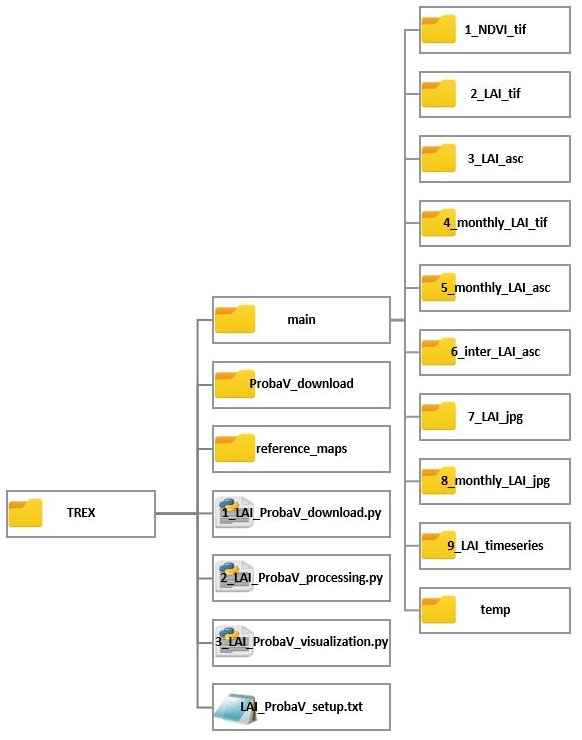

# Tool for Raster data EXploration 

Authors: Joanna Suliga, Joy Bhattacharjee, Boud Verbeiren
Contact author: Joanna Suliga, joanna.suliga@vub.be

# 1. Introduction
---
Tool for Raster data EXploration has various application, however the main objective is to automatically process ProbaV sattelite images into timeseries of Leaf Area Index and challenge the negative impact of cloud coverege on optical sattelite data. As long as satelite can provide images for selected study area, this tool is flexible enough to process data:
* for any period of time,
* for any study area,
* for any projection system...
* or any spatial resolution

Pixels of ProbaV images after reprojecting from orginal degree units into metric system are reshaped into rectangulars, thus hindering their use for multispatial analysis. Through the improved utilization of GDAL software and programming in Python 2.7, this tool can, based on initial user input, automatically check radiometric quality, select cloudless images, reproject, resample, clip and adjust NDVI products of 100m ProbaV images. After specifying the reference raster or shapefile this tool can produce:
* NDVI raster maps at .tif format for each input image
* monhtly NDVI raster maps at .tif or .asc format
* LAI raster maps at .tif or .asc format for each input image
* monhtly LAI raster maps at .tif or .asc format
* interpolated raster LAI maps at .asc format
* color representation of LAI maps at .jpg format
* LAI timeseries exracted for specific points at .csv format
* color representation of LAI timeseries at .jpg format

# 2. Installation
---
The easiest way to set up the tool is to install [ANACONDA](https://www.anaconda.com/download/) for Python 2.7.14 Anaconda provides [Spyder](https://pythonhosted.org/spyder/) Python environment, manages the installation of Python packages and handles enviromental variables for Windows. If you are expecting a conflict between installed software (ex. ArcGIS) and Anaconda please try this [MANUAL](https://github.com/VUB-HYDR/TREX/blob/master/MANUAL.md). The table below specifies which version of Python packages were used for scripts development and should be installed before running the script:

 #| name       | 	version
--|------------|-
1 | gdal       |2.2.2
2 | pandas     |0.22.0
3 | numpy      |1.14.2
4 | matplotlib |2.2.2
5 | IPython    |5.6.0
6 | shutil     |built-in
7 | os         |built-in
8 | sys        |built-in
9 | ftplib     |built-in

More recent versions of listed packages should be still compatible.

# 3. Tool's structure
---
Tool's folder has a fixed structure that has to be respected and never modified, unless those changes are fully intended. Tool consists of three scripts written in Python 2.7, setup text file, folder with temporal data and folders containing input or output data. Scripts do not interact with each other but saves and reads data from different folders. User through "LAI_ProbaV_setup.txt" file can specify which of type input or output scripts will read and process. Each script should be run seperetely using [SPYDER](https://pythonhosted.org/spyder/) Python environment. 

### Input data
There are three types of input data for the tool:
* **Reference raster**

This map is a raster .tif that represents the area of interest e.g. a catchment shape. All outputs will be reprojected, resampled and clipped to the exact extend of that raster. The reference raster must have set a projection and no data. This raster should have a name specified in setup file (*LAI_ProbaV_setup.txt*) and be located in the folder *reference_maps*.
* **Extraction points**

This map is a shapefile .shp that containts points of interest. Coordinates of those points will be used for deriving timeseries of LAI. This raster should have a name specified in the setup file ( *LAI_ProbaV_setup.txt*); be located in the folder *reference_maps* and has the same projection as the reference raster.
* **ProbaV maps**

ProbaV is a small satellite launched by ESA and managed by VITO that provides almost daily NDVI maps at 100m, 300m and 1km spatial resolution. ProbaV images can be requested (for free) through [VITO Earth Observation portal](https://www.vito-eodata.be/PDF/portal/Application.html#Home). Order should *always* contain two types of images: NDVI maps and SM (status maps) at .tif format delivered using ftp server. Downloading images from the ftp server is handled by the first script *1_LAI_ProbaV_download.py*.

### Scripts
They are three main scripts:
* **1_LAI_ProbaV_download.py**

First script is used for downloading satellite images from ftp server provided by VITO. Adress to this online repository is individually granted and send by email after user succesful ordering satelite data from the [VITO Earth Observation portal](https://www.vito-eodata.be/PDF/portal/Application.html#Home). After providing login, password and name of the repository (directly into Spyder console), the script will download and save all data in the folder ProbaV_download.
* **2_LAI_ProbaV_processing.py**

Second srcipt calls GDAL functions for processing raster data into format specified by user in *LAI_ProbaV_setup.txt*. Results of this script are called primary outputs and are further explained in chapter 4. Processing script checks radiometric quality of images, discards clouded images (threshold to be set in *LAI_ProbaV_setup.txt*), convert to physical values, reproject,  resample, clipp and adjust extend to match reference raster. This script produces maps at .tif or .asc format suitable for ArcGIS or QGIS. Primary outputs are stored inside *main* folder in subfolders numbered from 1 to 6.
 
* **3_LAI_ProbaV_visualization.py**. 

Third script is focused on producing secondary outputs (more in chapter 4) timeseries or color representation of processed maps. It automatically produces graphs with the same axis or color scale and stores inside *main* folder in subfolders numbered from 7 to 9.

# 4. ProbaV setup file
---

### Setup overview
*LAI_ProbaV_setup.txt* is a key file to control all inputs and outputs generated by scripts. They are 14 main variables grouped into 3 categories: input data, primary outputs (from 2_LAI_ProbaV_processing.py) and secondary outputs (from 3_LAI_ProbaV_visualization.py). 
Each variable got a seperate number to help with quick identification.

= = = INPUT DATA = = = = = = = = = = = = = = = =

   #| name             | value (defined by user)
----|------------------|---------
[1] |Reference raster  |biebrza_30_utm.tif
[2] |Extraction points |points.shp
[3] |Cloud fraction    |0.5
[4] |Wipe out memory   |1

= = = PRIMARY OUTPUT (from 2_LAI_ProbaV_processing.py) = = =

   #| name             | value (defined by user)
----|------------------|---------
[5] |NDVI.tif maps     |1
[6] |LAI.tif maps      |1
[7] |LAI.asc maps      |1
[8] |Monthly LAI.tif maps|1
[9] |Monthly LAI.asc maps|1
[10]|WETSPA format    |1

= = = SECONDARY OUTPUT (from 3_LAI_ProbaV_visualization.py) = = =

   #| name             | value (defined by user)
----|------------------|---------
[11]|LAI.jpg           |1
[12]|monthly LAI.jpg   |1
[13]|LAI timeseries.csv|1
[14]|LAI timeseries.jpg|1

### Dependencies
Scripts do not interact directly with each other but are using results generated with different steps. Generating .jpg files require certain images be first processed into .asc format. All dependencies between Primary Outputs (red color) and Secondary Outputs (green color) have been shown below.
WARNING: Specifying a [1] reference raster and a [3] cloud fraction is MANDATORY before running the script. Shapefile with extraction points is optional depending wheter the User wants to generate timeseries or not.

### Value type
This file defines settings nessesary to run the core script of "Tools for Raster data EXploration". The first section cointains a table with three columns: "#" (number of item), "name" (name of the element) and "value" (defined by user). The last column can be edited by the User. Valid values are:

#### [1] Reference raster
>Value type: string. EXAMPLE: "name.tif"
Specify a name of a reference raster located in "...\\reference_maps"

#### [2] Extraction points
> Value type: string. EXAMPLE: "points.shp"
Specify a name of a vector map containing extration points located in "...\\reference_maps"

#### [3] Cloud fraction
> Value type: float. Value range from 0.0 to 1.0
Algorithm will discard any image that has more than certain % of invalid pixels (clouds, shadows, disturbed signal etc)
0.95 = maximum 95% of all pixels is invalid (clouded)
0.05 = maximum 5% of all pixels is invalid (clear)

#### [4] Wipe out memory
> Value type: binary. Set 1 for yes (true) and 0 for no (false).
This function deletes all files in all subfolders of folder *main*. After modyfing reference raster it's highly recommended to delete old files (set value = 1). In other cases (e.g. generating more formats) it might be useful to keep presteps (set value = 0).

#### [5 - 13] 
>Value type: binary. Set 1 for yes (true) and 0 for no (false).

[4] Step 1: Clear directories?

[5] Step 2: Generate NDVI.tif maps?

[6] Step 3: Generate LAI.tif maps?

[7] Step 4: Generate LAI.asc maps?

[8] Step 5: Generate monthly LAI.tif maps?

[9] Step 6: Generate monthly LAI.asc maps?

[10] Step 7: Generate WETSPA input?

[11] Step 8: Generate LAI.jpg?

[12] Step 9: Generate monthly LAI.jpg?

[13] Step 10: Generate LAI timeseries?

## Versions
Version 0.1.0 - April 2018  

## License
See also the [LICENSE](./LICENSE.md) file.

